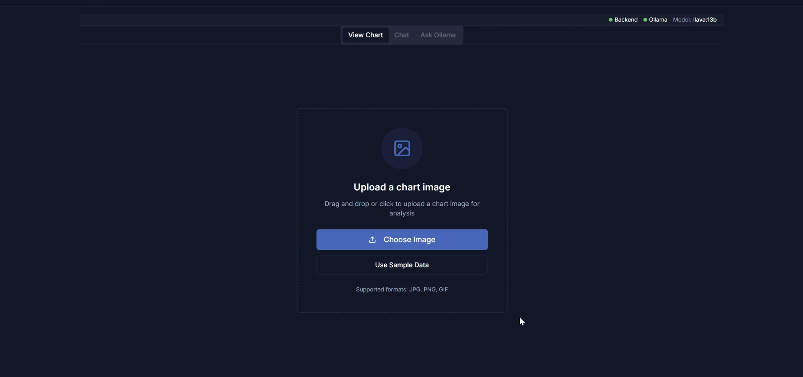
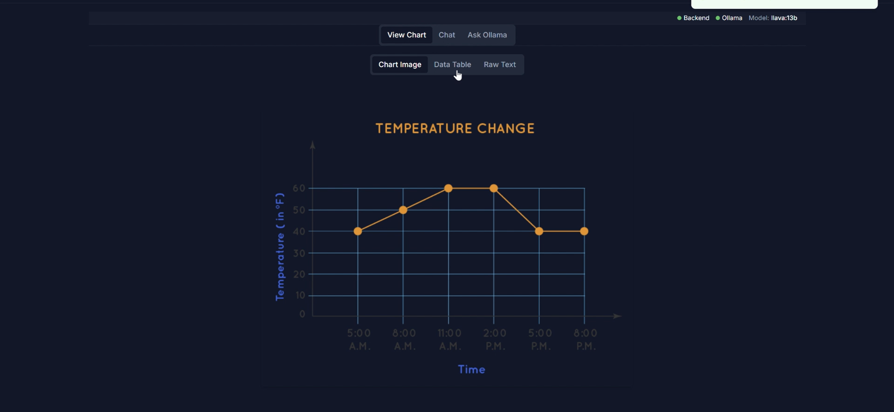
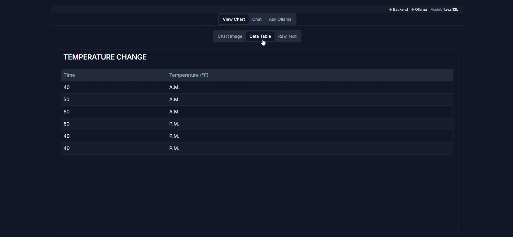
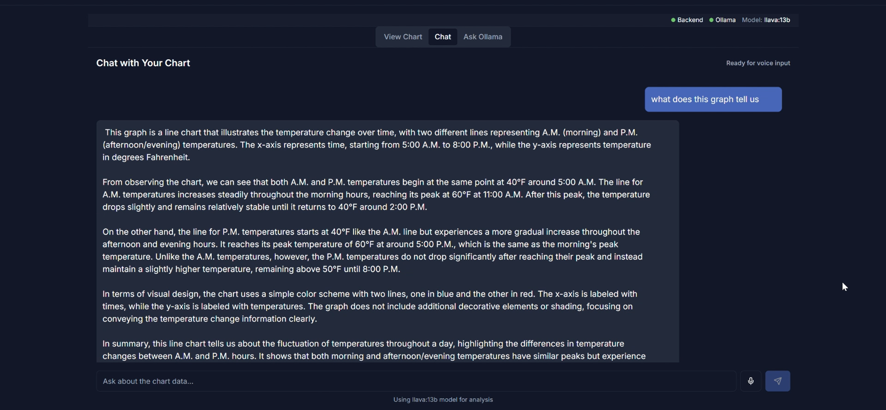

# AskTheChart - Accessible Graph Insights

## Description

AskTheChart is a web application designed to make graph data accessible to everyone, especially those who find graphs difficult to interpret or individuals with visual impairments. The platform converts visual graphs into easily navigable data tables and provides both text and voice interfaces for interacting with the extracted data.

By leveraging advanced AI models, AskTheChart transforms complex visualizations into accessible formats, allowing users to query and understand graph data through natural language conversations.

## Features

- **Graph to Table Conversion**: Automatically extracts data from uploaded graph images and converts them to accessible tables using Google's DePlot
- **Voice Input \& Output**: Ask questions about your data using voice commands and receive spoken responses
- **Multimodal Analysis**: Utilizes LLaVA 13b to understand both the visual and tabular representation of data
- **Multiple View Options**: Switch between original chart image, extracted data table, and raw text views
- **Conversational Interface**: Chat with your data using natural language questions
- **Accessible Design**: User-friendly dark mode interface optimized for various accessibility needs
- **Multiple File Format Support**: Upload graphs in JPG, PNG, or WEBP formats


## Technology Stack

- **Frontend**: React.js, Tailwind CSS, Vite
- **Backend**: Python
- **AI/ML**:
    - LLaVA 13b multimodal LLM for visual-textual reasoning
    - Google's DePlot for graph-to-table conversion
- **Accessibility**: Voice input/output integration


## Demo

### Home Screen

Upload your graph image by dragging and dropping or clicking to select a file.



### Chart Analysis

After uploading, AskTheChart processes and displays your chart with analysis options.



### Data Table View

The application automatically extracts data points from your graph into an accessible table format.



### Ask Questions About Your Data

Chat with your data using natural language. Type or use voice commands to ask questions about the graph.



## How It Works

1. **Upload**: Users upload graph images through the intuitive interface
2. **Extraction**: Google's DePlot technology extracts data points from the image
3. **Conversion**: The system generates an accessible data table from the extracted information
4. **Interaction**: Users can ask questions about the data using text or voice
5. **Analysis**: LLaVA 13b multimodal LLM processes both the original image and extracted data
6. **Response**: The system provides detailed answers in text format and optionally as voice output

## Installation

```bash
# Clone the repository
git clone https://github.com/RUSHABHS1027/AskTheChart.git

# Navigate to project directory
cd AskTheChart

# Install backend dependencies
pip install -r requirements.txt

# Navigate to frontend directory
cd frontend

# Install frontend dependencies
npm install

# Start the development server
npm run dev
```


## Usage

1. Launch the application and navigate to the home screen
2. Upload a graph image by clicking "Choose Image" or dragging a file to the upload area
3. Once processing is complete, switch between Chart Image, Data Table, and Raw Text views
4. Click on the Chat tab to ask questions about your data
5. Type your question or click the microphone icon to use voice input
6. View the response in text format or listen to the spoken answer